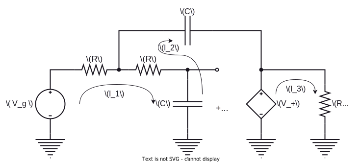

Linear Networks Analysis and Synthesis

# Lab 1

Academic year 2023-2024

Alonso Herreros Copete

---

## 1.1 Preparatory Homework

The circuit in the figure 2 shows a well-known and widely used circuit often referred to as
*Sallen-Key*

 Figure 2: Sallen-Key Circuit 

1. In view of the circuit, estimate without calculating the transfer function the value of $V_o(ω)/V_g(ω)$ for
   $ω = 0$ and $ω = ∞$. Recall that the impedance of a capacitor depends on the angular frequency $ω$ of the
   signal.

   > We can use the fact that capacitors act as open circuits at $ω = 0$ and as short circuits at $ω = ∞$ to
   > estimate the behavior of the circuit at these frequencies. The Operational Amplifier is in a *voltage
   > buffer* (also known as *voltage follower*) configuration, which has a gain of 1.
   >
   > At $ω = 0$, both capacitors act as **open cirucits**, resulting in the following equivalent circuit:
   >
   > 
   >
   > Having an ideal OpAmp, the currents at both input terminals are zero.
   >
   > $$
   > i_+ = i_- = 0  ⟹  v_+ = v_g
   > $$
   >
   > From the voltage follower behavior, we can conclude that $v_o(t) = v_g(t)$ when $ω = 0$, so
   > the transfer function is $V_o(ω)/V_g(ω) = 1$ at $ω = 0$.
   >
   > ---
   >
   > At $ω = ∞$, both capacitors act as **short circuits**, resulting in the following equivalent
   > circuit.
   >
   > 
   >
   > Due to the shorting to ground at the positive OpAmp terminal, the input to the *voltage buffer* will
   > always be $0$.
   >
   > $$
   > v_+ = 0 ⟹ v_o = 0
   > $$
   >
   > This might seem contradicting with the same output node being connnected to the point between both $R$
   > resistors, but it's actually compatible: the voltage at this point is also 0, and no current flows
   > through the second $R$ resistor. All current going through the first $R$ resistor is drained through the
   > input of the ideal Operational Amplifier, which has 0 output impedance, keeping the voltage at $v_o$
   > equal to $0$. Therefore, the transfer function is $V_o(ω)/V_g(ω) = 0$ at $ω = ∞$.
   >
   > ---

2. Assume that the circuit works in sinusoidal steady state and obtain the transfer function defined by the
   following ratio:

    $$
    H(ω) = \frac{V_o(ω)}{V_g(ω)}
    $$

    > Using the following [equivalent circuit](https://tinyurl.com/224jqvnv "Falstad circuit"), we can perform
    > mesh analysis and come up with three mesh equations to solve for the currents $I_1$, $I_2$ and $I_3$.
    >
    > 
    >
    > $$
    > \begin{aligned}
    >     V_g &= I_1 \left(2R + \frac{1}{jωC}\right) - I_2 \left(R + \frac{1}{jωC}\right) \\
    >     0   &= -I_1 \left(R + \frac{1}{jωC}\right) + I_2 \left(R + \frac{2}{jωC}\right) + V_+ \\
    >     V_+ &= I_3 \left(R_L\right) \\
    > \end{aligned}
    > $$
    >
    >
    > Using the substitution $V_+ = (I_1 - I_2) \frac{1}{jω C}$, we can rewrite the equations as:
    >
    > $$
    > \begin{aligned}
    >     V_g &= I_1 \left(2R + \frac{1}{jωC}\right) - I_2 \left(R + \frac{1}{jωC}\right) \\
    >     0   &= -I_1 (R)                            + I_2 \left(R + \frac{1}{jωC}\right) \\
    >     0   &= -I_1 \frac{1}{jω C} + I_2 \frac{1}{jω C} + I_3 (R_L) \\
    > \end{aligned}
    > $$
    >
    > This can then be expressed in matrix form:
    >
    > $$
    > \begin{bmatrix}
    >     2R + \frac{1}{jωC} & -R - \frac{1}{jωC} & 0 \\
    >     -R & R + \frac{1}{jωC} & 0 \\
    >     \frac{-1}{jωC} & \frac{1}{jωC} & R_L
    > \end{bmatrix}
    >
    > \begin{bmatrix}
    >     I_1 \\
    >     I_2 \\
    >     I_3
    > \end{bmatrix}
    >
    > =
    >
    > \begin{bmatrix}
    >     V_g \\
    >     0 \\
    >     0
    > \end{bmatrix}
    > $$
    >
    > We can solve it using Cramer's rule:
    >
    > $$
    > \begin{aligned}
    > \det(A) &=
    > \begin{vmatrix}
    >     2R + \frac{1}{jωC} & -\left(R + \frac{1}{jωC}\right) & 0 \\
    >     -R & R + \frac{1}{jωC} & 0 \\
    >     \frac{-1}{jωC} & \frac{1}{jωC} & R_L
    > \end{vmatrix} \\
    > &= R_L \left(
    >     \left( 2R + \frac{1}{jωC} \right)\left( R + \frac{1}{jωC} \right) -
    >     R \left( R + \frac{1}{jωC} \right)
    > \right) \\
    > &= R_L \left( R + \frac{1}{jωC} \right)^2  \\
    > \end{aligned}
    > $$
    >
    > $$
    > I_1
    > = \frac{
    >     \begin{vmatrix}
    >         V_g & -R - \frac{1}{jωC} & 0 \\
    >         0 & R + \frac{1}{jωC} & 0 \\
    >         0 & \frac{1}{jωC} & R_L
    >     \end{vmatrix}
    > }{
    >     \det(A)
    > }
    >   = \frac{R_L V_g \left(R+\frac{1}{jωC}\right)}{R_L \left( R + \frac{1}{jωC} \right)^2}
    > = \frac{1}{R + \frac{1}{jωC}} V_g \\
    >
    > I_2
    > = \frac{
    >     \begin{vmatrix}
    >         2R + \frac{1}{jωC} & V_g & 0 \\
    >         -R & 0 & 0 \\
    >         \frac{-1}{jωC} & 0 & R_L
    >     \end{vmatrix}
    > }{
    >     \det(A)
    > }
    >   = \frac{R_L V_g R}{R_L \left( R + \frac{1}{jωC} \right)^2}
    > = \frac{R}{\left(R + \frac{1}{jωC}\right)^2} V_g \\
    >
    > \begin{aligned}
    > I_3
    > = \frac{
    >     \begin{vmatrix}
    >         2R + \frac{1}{jωC} & -\left(R + \frac{1}{jωC}\right) & V_g \\
    >         -R & R + \frac{1}{jωC} & 0 \\
    >         \frac{-1}{jωC} & \frac{1}{jωC} & 0
    >     \end{vmatrix}
    > }{
    >     \det(A)
    > }
    >   &= \frac{V_g \left(-R +R +\frac{1}{jωC}\right) \frac{1}{jωC}}{R_L \left(R +\frac{1}{jωC}\right)^2} \\
    > %   = \left(\frac{\frac{1}{jωC}}{R + \frac{1}{jωC}}\right)^2 \frac{V_g}{R_L}
    > &= \frac{1}{R_L\left(jωCR + 1\right)^2} V_g
    > \end{aligned}
    > $$
    >
    > Finally, we can use the current $I_3$ to obtain the output voltage, and divide by the input voltage to
    > obtain the transfer function $H(ω)$:
    >
    > $$
    > H(ω) = \frac{V_o(ω)}{V_g(ω)} = \frac{I_3 R_L}{V_g} = \frac{1}{\left(jωCR + 1\right)^2}
    > $$

3. Find the ratio between the square of the amplitudes of the input $v_g(t)$ and the output $v_o(t)$ for each
   angular frequency $ω$. That is:

    $$
    |H(ω)|^2 = \frac{|V_o(ω)|^2}{|V_g(ω)|^2}
    $$

    > This is a matter of squaring the magnitude of the transfer function obtained above. Using some
    > properties of the magnitudes of products and quotients, it becomes a simple task:
    >
    > $$
    > \begin{aligned}
    >     |H(ω)|^2 &= \frac{|V_o(ω)|^2}{|V_g(ω)|^2} \\
    >     &= \left|\frac{1}{(jωCR + 1)^2}\right|^2 \\
    >     &= \frac{|1|}{|jωCR + 1|^4} \\
    >     &= \frac{1}{\left(\sqrt{ω^2 C^2 R^2 + 1}\right)^4} \\
    >     &= \frac{1}{\left(ω^2 C^2 R^2 + 1\right)^2}
    > \end{aligned}
    > $$

4. Determine, as a function of $R$ and $C$, the angular frequency $ω$ in which the amplitude of the output
   signal $v_o(t)$ is 3 dB lower than the amplitude of the input signal $v_g(t)$. That is, to find the angular
   frequency $ω$ that verify

    $$
    |H(ω)|^2 = \frac{1}{2}
    $$

    > Using the previous result, we can obtain this by solving for $ω$ in the resulting equation:
    >
    > $$
    > \begin{aligned}
    >     |H(ω)|^2 = \frac{1}{2} &⟺&& \frac{1}{\left(ω^2 C^2 R^2 + 1\right)^2} = \frac{1}{2} &⟹ \\
    >     &⟹&& ω^2 C^2 R^2 + 1 = \sqrt{2} &⟹ \\
    >     &⟹&& ω = \sqrt{\frac{\sqrt{2} - 1}{C^2 R^2}}
    >
    > \end{aligned}
    > $$

5. Calculate the current provided by the operational amplifier as a function of $V_g$, $R$, $C$, $R_L$ and
   $ω$.

    > I will assume that the current *provided* by the Operational Amplifier refers only to the current that
    > flows through the load resistor $R_L$, and not the the current coming from the top capacitor, which flows
    > through the output terminal of the OpAmp.
    >
    > This output current is the same as the current $I_3$ calculated above:
    >
    > $$
    > I_o\left(V_g, R, C, R_L, ω\right) = I_3 = \frac{V_g}{R_L\left(jωCR + 1\right)^2}
    > $$

6. The datasheet of the operational amplifier to be used specifies that the amplitude of the output current
   must always be less than 25 mA. If $R_L = 50 Ω$, what is the maximum value that the input signal
   amplitude can take in order not to exceed this margin when $ω ≈ 0$?

    > The previous consideration about the *output current* will be used. However, it's worth noting that the
    > amplifier would sustain greater *input* currents at its *output* due to the currents from the capacitor
    > mentioned above.
    >
    > Due to the low frequency, we can simplify the equation for the output current $I_o$ and easily calculate
    > the maximum input signal amplitude $V_g$ that to prevent exceeding the 25 mA output limit.
    >
    > $$
    > I_o = \frac{V_g}{R_L (\underbrace{jωCR}_{≈0} + 1)^2} ≈ \frac{V_g}{R_L} \\
    > $$
    > $$
    > \begin{aligned}
    >     \left|I_o\right| < I_{o;max} &⟹&& \left|\frac{V_g}{R_L}\right| < I_{o;max} ⟹ \\
    >     &⟹&& \left|V_g\right| < R_L I_{o;max} = 50 \text{ Ω} ⋅ 25 \text{ mA} = 1.25 \text{ V}
    > \end{aligned}
    > $$
    >
    > The input voltage should not exceed $±1.25 \text{ V}$ to comply with the output limits specified in the
    > datasheet.
  
**NOTE:** It is recommended to check with the simulator the results obtained for a particular election of
$R$ and $C$

> [Falstad Circuit Link](https://tinyurl.com/29etbpa6)
>
> The results were not completely consistent with the simulation, but the theoretical calculations, formulas
> and equations were checked against multiple sources.
