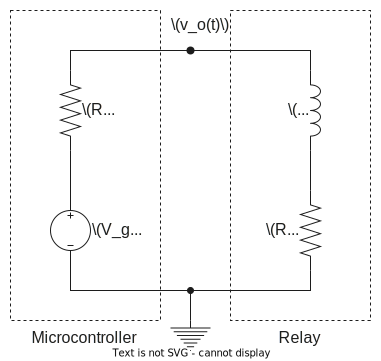
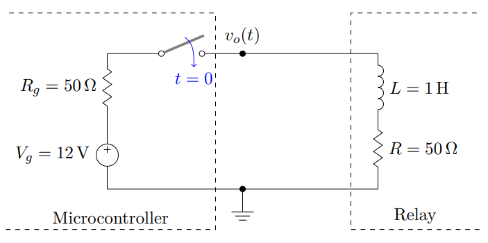
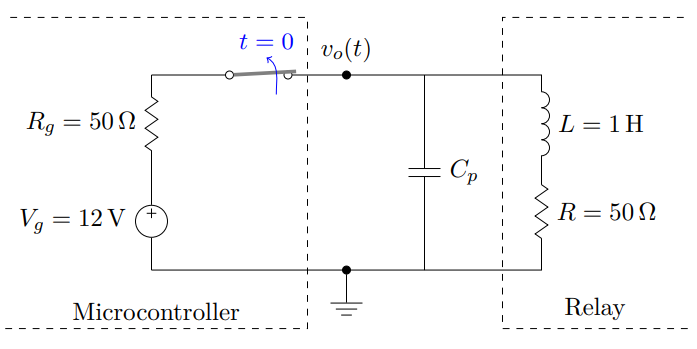

Linear Networks Analysis and Synthesis

# Lab 1 Session 2 - Relay activation/deactivation transient analysis

Academic year 2023-2024

Alonso Herreros Copete 
NIA: 100493990

---

<h2 class="center">
Preparatory Homework
</h2>

In this exercise we study the transient effect of the activation and deactivation of the coil present
in a relay. Let’s think of a microcontroller that activates/deactivates this relay by means of one
of its output pins, as shown in Figure 3.

### Question 1

Consider that the switch in figure 3 has been open for a long time, and that the micro-controller closes it at
an instant we define as $t = 0$. Determine

* (a) $I_L(s)$: current through the coil in the Laplace domain for $t > 0$.

    > As the intial state is in reset, the equivalent cirucit in the Laplace domain doesn't require any
    > additional sources.
    >
    > 
    >
    > The equation describing the circuit in Laplace domain for $t>0$ can be found using mesh analysis, where
    > $V_L(s) = sL I_L(s)$ and $V_g(s) = \mathcal{L}\left\{V_g\right\} = \frac{V_g}{s}$
    >
    > $$
    > \begin{aligned}
    >     I_L(s) &= \frac{V_g(s)}{R + R_g + sL} = \frac{V_g}{s(R + R_g + sL)} \\
    >     &= \frac{12}{100s + s^2} \text{ [A]}
    > \end{aligned}
    > $$

* (b) $I_s$: stationary value of the current reached after a long time $(t → ∞)$.

    > With a DC source, the angular frequency $ω$ is 0. Taking a constant input voltage $V_g(s) = V_g$ and $s
    > = jω = 0$ > 0$
    >
    > $$
    > I_s = \frac{V_g}{2R_g +0L} = \frac{V_g}{2R_g}
    > $$
    >
    > This means after a long enough time, the current is stabilized and the inductor behaves as a short
    > circuit.

* (c) $i_L(t)$: current through the coil in the time domain for $t > 0$.
* (d) If the relay is triggered when the current flowing through the coil is 80 % of the final value $I_s$,
  how long does it take for the relay to trigger from the time the microcontroller activates it (switch is
  closed)?

### Question 2

Consider now that the switch in figure 3 has been closed for a long time, and that the
microcontroller opens it (puts the output pin in the high-impedance state) at an instant
we redefine as $t = 0$.

Under these circumstances, calculate the voltage on the output pin in the Laplace domain,
$V_o(s)$, and in the time domain $v_o(t)$. Interpret the result and comment on whether you
foresee any problems in the microcontroller.

### Question 3

To avoid the possible problems mentioned in the previous point, a capacitor is connected
in parallel with the relay. $C_p = 200 μF$, as shown in figure 4. Assuming that the switch
has been closed for a long time before opening it at instant $t = 0$, determine:

* (a) $I_L(s)$: current through the coil in the Laplace domain for $t > 0$.
* (b) $V_o(s)$: voltage on the microcontroller output pin in the Laplace domain for $t > 0$.
* (c) $v_o(0+)$: voltage to be supported by the output pin of the microcontroller at $t = 0^+$. Has the
  problem discussed in section 2 been solved?

Figure 3: Microcontroller activates the relay at t = 0.

Figure 4: Microcontroller deactivates the relay at t = 0.

* (d) In view of the equation for the current flowing in the coil, what can be concluded about its behavior?
  What would you change in the circuit to avoid this effect?
