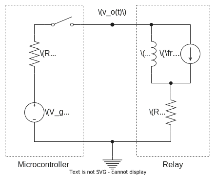
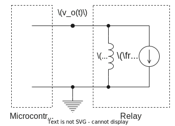

Linear Networks Analysis and Synthesis

# Lab 1 Session 2 - Relay activation/deactivation transient analysis

Academic year 2023-2024

Alonso Herreros Copete 
NIA: 100493990

---

<h2 class="center">
Preparatory Homework
</h2>

In this exercise we study the transient effect of the activation and deactivation of the coil present
in a relay. Let’s think of a microcontroller that activates/deactivates this relay by means of one
of its output pins, as shown in Figure 3.

### Question 1

Consider that the switch in figure 3 has been open for a long time, and that the micro-controller closes it at
an instant we define as $t = 0$. Determine

* (a) $I_L(s)$: current through the coil in the Laplace domain for $t > 0$.

    > As the intial state is in reset, the equivalent cirucit in the Laplace domain doesn't require any
    > additional sources.
    >
    > 
    >
    > The equation describing the circuit in Laplace domain for $t>0$ can be found using mesh analysis, where
    > $V_L(s) = sL I_L(s)$ and $V_g(s) = \mathcal{L}\left\{V_g\right\} = \frac{V_g}{s}$
    >
    > $$
    > \begin{aligned}
    >     I_L(s) &= \frac{V_g(s)}{R + R_g + sL} = \frac{V_g}{s(R + R_g + sL)} \\
    >     &= \frac{12}{100s + s^2} \text{ [A]}
    > \end{aligned}
    > $$

* (b) $I_s$: stationary value of the current reached after a long time $(t → ∞)$.

    > Taking a constant input voltage $V_g(s) = V_g$ and applying the final value theorem:
    >
    > $$
    > \begin{aligned}
    >     I_s &= \lim_{t → ∞} i_L(t) = \lim_{s → 0} sI_L(s) \\
    >     &= \lim_{s → 0} s \frac{V_g}{s(R + R_g + sL)} \\
    >     &= \frac{V_g}{R + R_g} \\
    >     &= 120 \text{ mA}
    > \end{aligned}
    > $$
    >
    > This means after a long enough time, the current is stabilized and the inductor behaves as a short
    > circuit, leaving only the two resistors contributing with their impedance.

* (c) $i_L(t)$: current through the coil in the time domain for $t > 0$.

    > We can find the time domain expression for the current through the coil by taking the inverse Laplace of
    > the expression found in the first question. First, we'll use Partial Fraction Decomposition to simplify
    > the expression.
    >
    > $$
    > I_L(s) = \frac{V_g}{s(R + R_g + sL)} = \frac{A}{s} + \frac{B}{(R + R_g + sL)}\\
    > $$
    >
    > Where
    >
    > $$
    > \begin{aligned}
    >     A &= \lim_{s→ 0} s \frac{V_g}{s(R + R_g + sL)} &&= \frac{V_g}{R + R_g} \\
    >     B &= \lim_{s→ -\frac{R+R_g}{L}} \frac{(R + R_g + sL) V_g}{s(R + R_g + sL)} &&= -\frac{LV_g}{R + R_g}
    > \end{aligned}
    > $$
    >
    > Leaving us with this expression.
    >
    > $$
    > I_L(s) = \frac{V_g}{s(R + R_g)} - \frac{L V_g}{(R + R_g + sL)(R + R_g)} \\
    > $$
    >
    > Then, we can adjust the expression to a suitable form and use the inverse Laplace transform of these
    > terms to find the time domain expression for the current.
    >
    > $$
    > \begin{aligned}
    >     i_L(t) &= \mathcal{L}^{-1}\left\{I_L(s)\right\} \\
    >     &= \mathcal{L}^{-1}\left\{\frac{V_g}{s(R + R_g)} - \frac{L V_g}{(R + R_g + sL)(R + R_g)}\right\} \\
    >     &= \frac{V_g}{R + R_g} \left( \mathcal{L}^{-1} \left\{\frac{1}{s}\right\}
    >         - \mathcal{L}^{-1} \left\{\frac{1}{(\frac{R + R_g}{L} + s)}\right\} \right) \\
    >     &= \frac{V_g}{R + R_g} \left( 1 - e^{-\frac{R + R_g}{L} t} \right) \\
    >     &= 120 \left( 1 - e^{-100 t} \right) \text{ [mA]}
    > \end{aligned}
    > $$

* (d) If the relay is triggered when the current flowing through the coil is 80 % of the final value $I_s$,
  how long does it take for the relay to trigger from the time the microcontroller activates it (switch is
  closed)?
  
    > This is a matter of finding the time $t_{80}$ that it takes for the current $i_L$ to reach $0.8 I_s$ in a the
    > studied scenario (switch is closed at $t = 0$). We can use the equations found in the preivous questions for
    > this.
    >
    > $$
    > \begin{aligned}
    >     && i_L(t_{80}) &= 0.8 I_s &⟹ \\
    >     &⟹& \frac{V_g}{R + R_g} \left( 1 - e^{-\frac{R + R_g}{L} t_{80}} \right) &= 0.8 \frac{V_g}{R + R_g} &⟹ \\
    >     &⟹& e^{-\frac{R+R_g}{L} t_{80}} &= 1 - 0.8 &⟹ \\
    >     &⟹& -\frac{R + R_g}{L} t_{80} &= \ln(0.2) &⟹ \\
    >     &⟹& t_{80} &= -\frac{L}{R + R_g} \ln(0.2) \\
    >     &&&= - \frac{1}{50+50} \ln(0.2) \\
    >     &&&= 16.09 ⋅ 10^{-3} \text{ [s]} \\
    > \end{aligned}
    > $$
    >
    > It would take the relay 16.09 ms to trigger in this scenario.

### Question 2

Consider now that the switch in figure 3 has been closed for a long time, and that the
microcontroller opens it (puts the output pin in the high-impedance state) at an instant
we redefine as $t = 0$.

Under these circumstances, calculate the voltage on the output pin in the Laplace domain,
$V_o(s)$, and in the time domain $v_o(t)$. Interpret the result and comment on whether you
foresee any problems in the microcontroller.

> By using the stabilized current $I_s$ obtained in the previous question, we can find an equivalent circuit
> in the Laplace domain, adding a current source in parallel with the inductor to account for the initial
> current flowing trough it, $i_L(0^-) = I_s$.
>
> 
>
> Due to the high impedance state of the microcontroller pin acting as an open circuit, this can be further
> simplified:
>
> 
>
> Using node analysis, we can find the voltage on the output pin, $v_o(t)$
>
> $$
> \begin{aligned}
>     && \frac{I_s}{s} &= \frac{0-v_o(s)}{sL} &⟹ \\
>     &⟹& v_o(s) &= -I_s L \\
>     &&& = -120 ⋅ 10^{-3} \text{ [V]}
> \end{aligned}
> $$
>
> From here, using the inverse Laplace transform, we can find the time domain expression for the voltage on
> the output pin, $v_o(t)$
>
> $$
> \begin{aligned}
>     v_o(t) &= \mathcal{L}^{-1} \{-I_s L\} \\
>     &= -I_s L δ(t) \\
>     &= -120 ⋅ 10^{-3} δ(t) \text{ [V]}
> \end{aligned}
> $$
>
> This delta function in our time domain expression suggests that there will be an unbound voltage spike in
> the opposite direction as soon as the switch is opened. This unbound voltage could potentially damage the
> controller. A capacitor may be added in parallel with the relay in order to limit the effect of this sudden
> (high-frequency change).

### Question 3

To avoid the possible problems mentioned in the previous point, a capacitor is connected
in parallel with the relay. $C_p = 200 μF$, as shown in figure 4. Assuming that the switch
has been closed for a long time before opening it at instant $t = 0$, determine:

* (a) $I_L(s)$: current through the coil in the Laplace domain for $t > 0$.
* (b) $V_o(s)$: voltage on the microcontroller output pin in the Laplace domain for $t > 0$.
* (c) $v_o(0+)$: voltage to be supported by the output pin of the microcontroller at $t = 0^+$. Has the
  problem discussed in section 2 been solved?

Figure 3: Microcontroller activates the relay at t = 0.

Figure 4: Microcontroller deactivates the relay at t = 0.

* (d) In view of the equation for the current flowing in the coil, what can be concluded about its behavior?
  What would you change in the circuit to avoid this effect?
