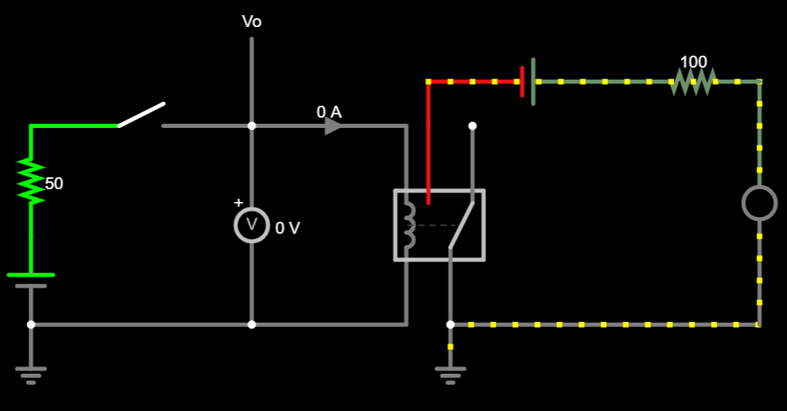
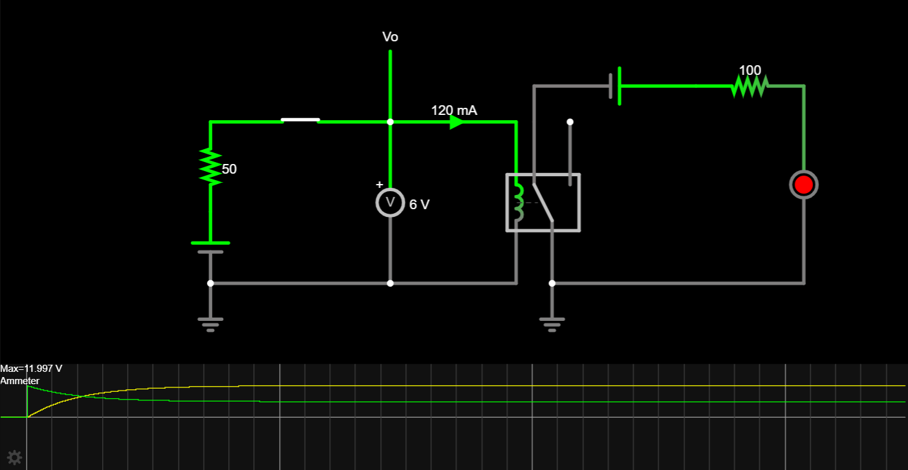
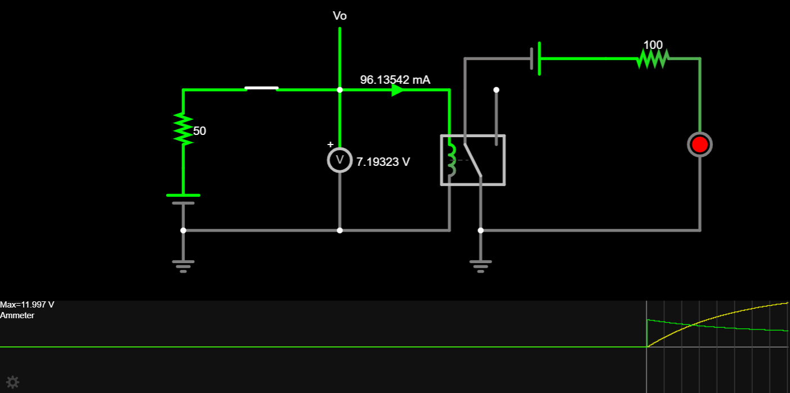
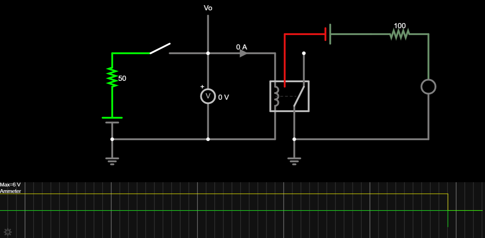
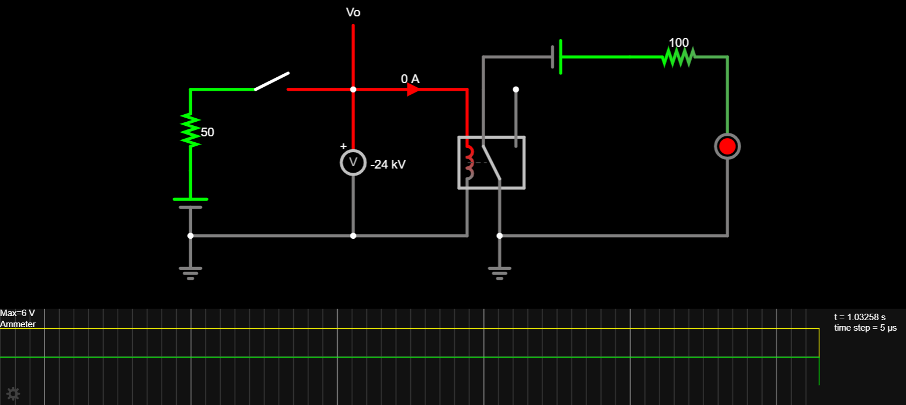

Linear Networks Analysis and Synthesis. Lab 1, April 2024

# Session 2

**FULL NAME:** Alonso Herreros Copete
**DEGREE/GROUP:** Telecommunication Techonologies Engineering / 95
**DATE and TIME:** Friday 12th April 2024, 11:00
**CLASSROOM:** Room 4.1.E05

## 1. Measurement of the voltage and current at the output of the microcontroller

This [link](https://tinyurl.com/28rkgpau) shows the simulation of a circuit where the relay that you have
studied in the preparatory work is used to activate/deactivate a led. From this circuit diagram:

* Add an ammeter to measure the current flowing through the relay coil when the switch is activated. Comment
  what the ideal impedance of an ammeter would be taking into account that its objective is to measure current
  without disturbing the circuit.
* Add a voltmeter to measure the voltage at the output pin of the microcontroller (the connector one on the
  right of the switch, voltage $v_o(t)$ in the preparatory work). Comment what would be the ideal impedance of
  a voltmeter considering that its purpose is to measure voltage without disturbing the circuit.

> The ideal impedance of the ammeter would be zero, acting as a simple wire that reports the current flowing
> through it.
>
> The ideal impedance of the voltmeter would be inifinite, acting as an open circuit "connected" to ground
> (the reference point) and measuring the voltage at the point where it is connected.
>
> 
>
> 

> Falstad Link: <a href="https://tinyurl.com/29rojfxa">https://tinyurl.com/29rojfxa</a>
> 

## 2. Stationary current of the relay activated
When the relay is activated, what value does the current flowing through the relay coil tend to after a long
time? Relate the result with what was seen in the preparatory work. [2%]

> After a long time, the current tends to 120 mA, as seen in the preparatory work. Although it is not shown in
> the circuit diagram, the relay is modeled as a coil with a 1 H inductance and 50 Ω resistance, just as the
> one studied in the preparatory work.
>
> 
>
> 

> Falstad Link: <a href="https://tinyurl.com/249rqayr">https://tinyurl.com/249rqayr</a>
> 

## 3. Stationary voltage at the output of the microcontroller
When the relay is activated, to what value does the voltage at the output pin $v_o(t)$? Justify theoretically
the result obtained.

> The voltage at the output pin $v_o(t)$ tends to 6 V, as expected from the previous work. This is because,
> after a long time, the relay's inductor behaves as a short circuit, the two remainig reisistors act as a
> voltage divider, with the measured voltage at the output ping being in the middle of both 50 Ω resistors.
> As a result, the generator voltage of 12 V is divided in half, giving us 6 V.
>
> 
>
> 

> Falstad Link: <a href="https://tinyurl.com/249rqayr">https://tinyurl.com/249rqayr</a>
> 

## 4. Relay activation time
Use oscilloscopes (scopes) to measure the time it takes for the relay to activate from the time the switch is
closed. That is, the time from the moment the relay is powered by the microcontroller until the LED turns on.
What is the current flowing through the coil at the moment when the relay switches? Does it coincide with the
data given in the previous work? NOTE: It is important to make a good selection of the time scale to take this
measurement.

> As expected from the previous work, the relay turns on after approximately 16.1 ms. At this moment, the
> current flowing through the coil is approximately 96 mA, which is exactly 80% of the stationary current
> (120 mA).
>
> 
>
> 

> Falstad Link: <a href="https://tinyurl.com/2xhwqm52">https://tinyurl.com/2xhwqm52</a>
> 

## 5. Deactivation time of the relay
Now we study the deactivation of the relay. Measure the time it takes for the LED to turn off (that is, for
the relay to deactivate) from the moment the switch is opened. What maximum voltage in absolute value is
measured at the output of the microcontroller? Explain what you observed.

> The relay was switched off after a very long time, in steady state. The relay turned off immediately, as
> shown in the previous work. As shown in the scope graph, the current fall is instantaneous.
>
> 
> 

>    Falstad Link: <a href="https://tinyurl.com/2xny4qtl">https://tinyurl.com/2xny4qtl</a>
> 

>
> As predicted in the preparatory work, there was an instantaneous unbounded voltage spike in the opposite
> direction. Here is a measurement of the maximum absolute value of the voltage at the output of the
> microcontroller. The voltmenter reported a magnitude of 24 kV, an alarmingly high value for the
> microcontroller.
>
> 

## 6. Effect of the capacitor in the deactivation of the relay
Now place the capacitor Cp=200 µF in parallel with the relay coil. When the relay is turned off:

* What is now the maximum absolute value of voltage at the output of the microcontroller?
* How long does it now take for the relay to deactivate from the time the switch is opened (i.e., how long
  does it take for the LED to turn off)?
* What would happen if the relay only activated once more than 1% of the current flowed through it instead of
  80%?

<!-- TODO: Insert the screenshot(s) here and, optionally, the link(s). -->

<!-- TODO: Insert here the explanation of what is observed in the screenshot and the reasoning of -->
your answer.

## 7. Effect of the capacitor on relay activation
After placing the capacitor Cp, has the relay activation process also been affected?

What is the time it now takes for the relay to energize?

<!-- TODO: Insert the screenshot(s) here and, optionally, the link(s). -->

<!-- TODO: Insert here the explanation of what is observed in the screenshot and the reasoning of -->
your answer.

## 8. Effect of capacitor capacity on relay activation/deactivation
Investigate and justify (especially in the relay deactivation process) what happens when instead of choosing a
value of 200 µF for the capacitor Cp the following values ​​are chosen:

1. 20 µF
2. 800 µF

<!-- TODO: Insert the screenshot(s) here and, optionally, the link(s). -->

<!-- TODO: Insert here the explanation of what is observed in the screenshot and the reasoning of -->
your answer.

## 9. Alternatives
There are other better solutions to discharge in a controlled way the relay coil.
Explore with the simulator the following alternatives:

1. Add a resistor in series with the capacitor Cp.
2. Replace the capacitor with a diode. The diode is a nonlinear element, but its behavior can be linearized
   modeling the diode as a short when forward biased, and as an open when reverse biased.

<!-- TODO: Insert the screenshot(s) here and, optionally, the link(s). -->

<!-- TODO: Insert here the explanation of what is observed in the screenshot and the reasoning of -->
your answer.